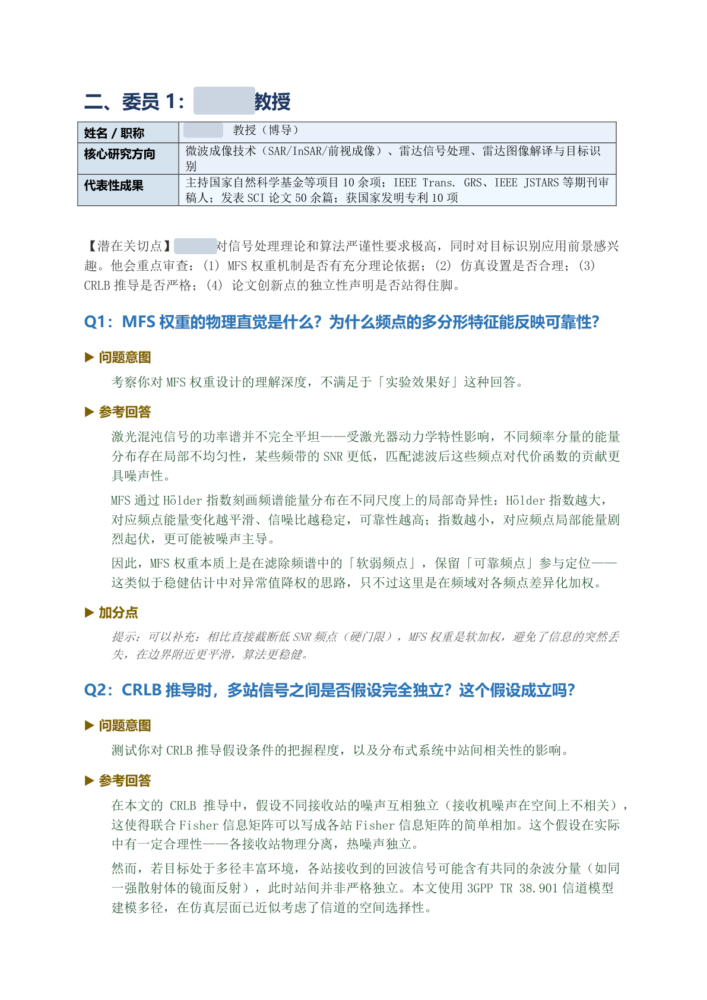
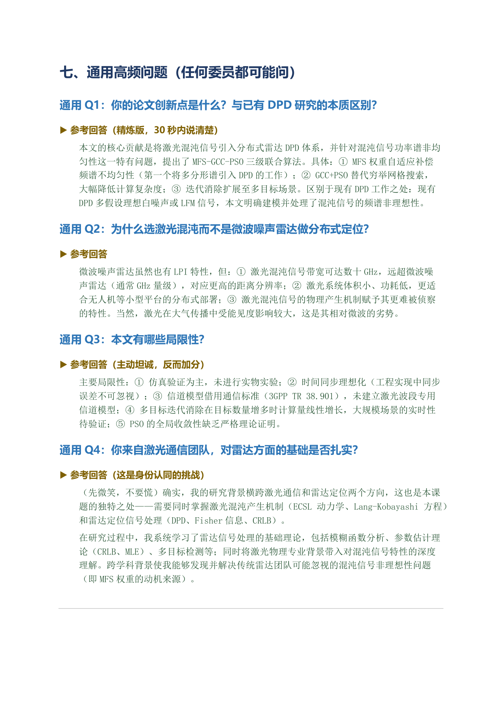
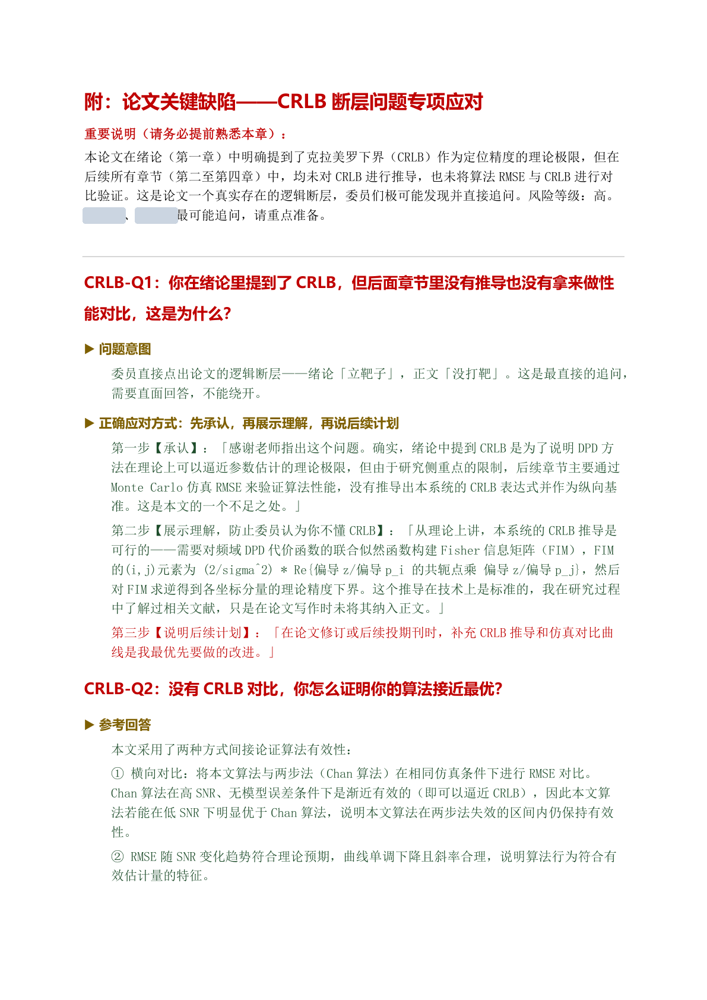

<div align="center">

# Thesis Defense Guide

### Committee-Aware Thesis Defense Preparation for Codex

[](https://developers.openai.com/codex/skills)
[](#compatibility)
[](LICENSE)
[](#word-output)

**Turn your thesis, defense materials, and committee list into a practical defense Q&A manual.**

Evaluator profiles. Risk radar. Stage-aware questions. 10/30/60-second oral answers. Polished Word output.

English | [中文](README_ZH.md)

</div>

---

## The Problem

Preparing for a thesis defense is not just about memorizing your thesis.

The hard part is knowing **who will ask what, why they will ask it, and how far your answer can safely go**.

Common preparation methods leave big gaps:

| Approach | Result |
|----------|--------|
| Generic defense question lists | Too broad, not tied to your committee |
| Reading your thesis repeatedly | Helps with recall, but not pressure handling |
| Asking AI for "possible questions" | Often produces generic questions without evaluator context |
| Hiding weak points | Makes you fragile when committee members press on evidence |

## The Solution

This skill teaches Codex to build a **committee-by-committee defense preparation manual**.

It reads your thesis or slides, researches public committee information, maps each evaluator's likely concerns to your work, and produces answers that are direct, bounded, and speakable under real defense pressure.

| Module | What It Does |
|--------|--------------|
| **Thesis Analysis** | Extracts title, claims, methods, evidence, limitations, and future work |
| **Evaluator Research** | Profiles each committee member using public sources and evidence strength labels |
| **Risk Radar** | Identifies vulnerable claims, missing evidence, and likely attack points |
| **Stage Strategy** | Adapts questions for proposal, midterm, pre-defense, final defense, viva, or written review |
| **Q&A Manual** | Produces evaluator-specific questions, intent, answers, bonus points, and follow-up scripts |
| **Claim Calibration** | Prevents overclaiming by rewriting risky thesis statements into safer oral wording |
| **Word Export** | Converts the final Markdown guide into a polished `.docx` manual |

## How It Works

The skill follows a structured workflow from intake to final rehearsal document:

```text
┌──────────────────┐     ┌──────────────────┐     ┌──────────────────┐
│   Phase 1        │     │   Phase 2        │     │   Phase 3        │
│                  │     │                  │     │                  │
│  Thesis Intake   │────▶│  Committee       │────▶│  Defense Manual  │
│  & Risk Reading  │     │  Mapping         │     │  Generation      │
│                  │     │                  │     │                  │
│  • Read thesis   │     │  • Research each │     │  • Write Q&A     │
│  • Extract claims│     │    evaluator     │     │  • Add scripts   │
│  • Find weak     │     │  • Map interests │     │  • Add red lines │
│    evidence      │     │    to thesis     │     │  • Export DOCX   │
└──────────────────┘     └──────────────────┘     └──────────────────┘
```

### Phase 1: Thesis Intake & Risk Reading

Codex reads the thesis, dissertation, slides, proposal, or draft materials and extracts the defense-critical parts:

- research problem and thesis title
- claimed contributions
- methods and assumptions
- experiments, data, and evaluation metrics
- limitations and future work
- claim-evidence mismatches

**Output**: thesis fact sheet, thesis risk radar, and claim calibration table.

### Phase 2: Committee Research & Mapping

Codex researches each evaluator from public sources, prioritizing official profiles, lab pages, publications, and institutional pages.

It separates:

- **confirmed facts** from official profiles or CVs;
- **medium-confidence patterns** from repeated publication themes;
- **low-confidence inferences** from adjacent research areas.

**Output**: evaluator profiles, evidence notes, and an evaluator-thesis mapping matrix.

### Phase 3: Defense Manual Generation

Codex writes a rehearsal-ready manual organized by evaluator.

Each evaluator section includes:

- profile card
- potential concern callout
- high-probability questions
- question intent
- 10-second answer
- 30-second answer
- 60-second answer
- bonus point
- follow-up handling
- chain follow-up script
- final defensive bottom line

## Defense Stage Awareness

The skill adapts its questions and answer style to the actual stage of your defense:

| Stage | Main Committee Concern | Question Emphasis |
|-------|------------------------|-------------------|
| **Proposal Defense** | Is the topic valuable and feasible? | Research gap, route choice, expected validation, risk control |
| **Midterm Defense** | Is the project on track? | Progress, unfinished work, schedule risk, method changes |
| **Pre-Defense** | Is the thesis ready to submit? | Structure, missing evidence, contribution wording, revision priorities |
| **Final Defense / Viva** | Are the contribution and evidence defensible? | Novelty, rigor, limitations, reproducibility, generalization |
| **Written Committee Review** | Is the written argument traceable? | Source evidence, compliance, argument structure, reviewer objections |

If the stage is unknown, the skill uses final defense / viva assumptions and states that assumption in the guide.

## Anti-Overclaiming Guardrails

This skill is designed to make you sound **strong but careful**.

It does not help you hide weak evidence or inflate the thesis. Instead, it calibrates your claims:

| Risky Move | Safer Defense Behavior |
|------------|------------------------|
| Treating simulation as real-world validation | Say the result supports the simulated setting only |
| Treating correlation as causality | State the observed relationship and the missing causal test |
| Treating a narrow experiment as universal proof | Limit the conclusion to the tested dataset or scenario |
| Treating future work as completed contribution | Present it as a next validation step |
| Ignoring missing baselines or ablations | Acknowledge the gap and explain what current evidence still supports |

The goal is not to weaken your work. The goal is to make your answer harder to attack.

## Quick Start

### Installation

Clone or download this repository:

```bash
git clone https://github.com/w1163222589-coder/thesis-defense-guide.git
```

Copy the skill folder into your Codex skills directory:

```bash
cp -r thesis-defense-guide ~/.codex/skills/
```

On Windows, the target is usually:

```text
C:\Users\<USER>\.codex\skills\thesis-defense-guide
```

Restart Codex after installing the skill.

Or install via CC Switch: Skills panel → Add from GitHub → paste the repo URL.

### Required Inputs

Before substantive research or drafting, provide:

1. your thesis or defense materials;
2. the committee/evaluator list;
3. your school, university, college, program, or lab context.

Accepted materials include PDF, DOCX, PPTX, Markdown, plain text, or a folder containing drafts and slides.

### Usage

In Codex, ask:

```text
Use $thesis-defense-guide to create a defense preparation manual.
My thesis materials are in this folder, my committee members are listed below,
and the defense is a final master's thesis defense at [school/program].
Please produce a Word guide with evaluator-specific questions, risk radar,
claim calibration, and 10/30/60-second oral answers.
```

For a proposal defense:

```text
Use $thesis-defense-guide for my proposal defense.
Focus on research value, feasibility, technical route, expected validation,
and likely committee concerns.
```

For pre-defense:

```text
Use $thesis-defense-guide for my pre-defense.
Focus on thesis structure, missing experiments, contribution wording,
and revision priorities before final submission.
```

## Output Structure

```text
defense-guide/
├── defense-guide.md          # Source Markdown manual
├── defense-guide.docx        # Polished Word guide
└── sources-appendix.md       # Optional public-source evidence appendix
```

The guide itself typically contains:

```text
Thesis Defense Q&A Guide
├── Background and Usage
├── Defense Stage Strategy
├── Thesis Fact Sheet
├── Thesis Risk Radar
├── Claim Calibration Table
├── Evaluator-Thesis Mapping Matrix
├── Committee Member 1
│   ├── Profile
│   ├── Potential Concern
│   ├── High-Probability Q&A
│   ├── Chain Follow-Up Script
│   └── Bottom Line
├── Committee Member 2
├── Universal Defense Controls
├── One-Page Rehearsal Sheet
└── Sources Appendix
```

## Example Output

The screenshots below are rendered from an anonymized real defense-preparation manual generated in this style. They show the kind of polished, committee-specific document this skill is designed to produce.

### Manual Cover


### Evaluator-Specific Q&A



### Universal Questions



### High-Risk Appendix



## Word Output

The bundled converter turns a generated Markdown manual into a styled `.docx` file:

```bash
python scripts/markdown_to_docx.py \
  --input defense-guide.md \
  --output defense-guide.docx \
  --title "Thesis Defense Q&A Guide"
```

The converter supports:

- headings and evaluator sections
- Markdown tables
- question labels
- shaded answer boxes
- dialogue-style follow-up scripts
- page headers and footers

## Key Design Decisions

### Why Organize by Evaluator?

Real defense questions are shaped by who is asking. A committee member who studies optimization may challenge algorithm assumptions; a committee member who studies systems may challenge deployment feasibility. Organizing by evaluator makes the manual easier to rehearse.

### Why Include Risk Radar?

Students often prepare their strongest points and avoid weak ones. Committees do the opposite. Risk radar makes weak evidence visible early, so you can prepare controlled answers before the defense.

### Why 10/30/60-Second Answers?

Defense Q&A is dynamic. Sometimes you need a one-sentence answer. Sometimes the chair lets you explain. Layered answers let you respond without rambling.

### Why Anti-Overclaiming?

Overclaiming is one of the easiest ways to lose credibility. A careful answer that admits the boundary of the work is usually stronger than a broad answer the evidence cannot support.

## Common Failure Modes & How the Skill Prevents Them

| Failure Mode | Symptom | Prevention |
|-------------|---------|------------|
| **Generic questions** | Questions could apply to any thesis | Evaluator-thesis mapping forces committee-specific pressure points |
| **Unsupported claims** | Answers sound confident but exceed evidence | Claim calibration rewrites risky wording |
| **Hidden limitations** | Student gets cornered when asked about weaknesses | Risk radar turns limitations into prepared answers |
| **Unclear defense stage** | Proposal questions and final-defense questions get mixed | Stage strategy changes the question emphasis |
| **Made-up evaluator facts** | Public profiles become hallucinated biographies | Evidence strength labels separate confirmed facts from inference |

## Compatibility

| Platform | Status | Notes |
|----------|--------|-------|
| OpenAI Codex | Fully supported | Primary target. Uses local file tools, web research, and bundled DOCX converter |
| Other AI agents | Adaptable | Any agent that can read files, browse public sources, and run Python can adapt the workflow |

## Project Layout

```text
.
├── README.md
├── README_ZH.md
├── LICENSE
├── SKILL.md
├── agents/
│   └── openai.yaml
├── references/
│   ├── manual-structure.md
│   └── style-rubric.md
└── scripts/
    └── markdown_to_docx.py
```

## Contributing

Issues, suggestions, and PRs are welcome.

Useful contributions include:

- stronger defense manual examples
- better evaluator research checklists
- DOCX layout improvements
- bilingual answer templates
- stage-specific question patterns for different disciplines

## License

MIT

## Acknowledgments

- [OpenAI Codex](https://openai.com/codex/) — the AI coding agent platform this skill targets
- [Agent Skills](https://agentskills.io) — the open standard for packaging reusable agent capabilities
- Real thesis defense pressure — the reason this skill exists
