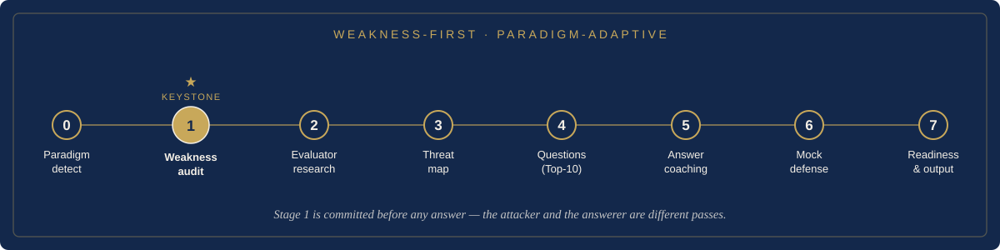

<div align="center">


# Thesis Defense Guide

### A defense simulator & risk-prediction system for any discipline

[](https://agentskills.io)
[](CHANGELOG.md)
[](#compatibility)
[](LICENSE)
[](#output)

**Turn your thesis, slides, and committee list into a committee-by-committee defense manual — with an honest weakness audit, reverse-engineered questions, bounded answers, an interactive mock defense, and a readiness score.**

Works for **any discipline** — sciences, engineering, social science, humanities, law, the arts — by detecting your research paradigm and adapting its standards.

English | [中文](README_ZH.md)

</div>

---

## Contents

🧩 [The Problem](#the-problem) · 🎯 [The Solution](#the-solution) · 🧭 [How It Works](#how-it-works) · 🎓 [Disciplines](#disciplines-paradigm-families) · 📄 [Output](#output) · 📥 [Required Inputs](#required-inputs) · 🚀 [Quick Start](#quick-start) · 🗂️ [Project Layout](#project-layout) · 🔌 [Compatibility](#compatibility) · 🙏 [Acknowledgments](#acknowledgments)

---

## The Problem

The hard part of a defense isn't re-reading your thesis. It's knowing **who will ask what, why, and how far your answer can safely go** — and finding the weak points *before* the committee does.

| Common approach | Why it falls short |
|---|---|
| Generic question lists | Too broad; not tied to your committee or your thesis's real weak points |
| Re-reading your thesis | Helps recall, not pressure-handling |
| Asking AI "what might they ask?" | Generic questions, no evaluator context, and the same voice writes the question *and* a reassuring answer — so it quietly softens the attacks that matter |
| Hiding weak points | You get cornered the moment a committee member presses on evidence |

## The Solution

This skill runs your materials through an **adversarial pipeline** and ships rehearsal-ready output:

1. **Detect the research paradigm** and judge everything by *that field's* standards.
2. **Audit weaknesses first — independently of the committee.** A dedicated, attack-only pass produces a read-only **Weakness Ledger** (severity-ranked, location-cited).
3. **Reverse-engineer the questions** a committee derives from those weaknesses, ranked into a **Top-10 most-dangerous** list.
4. **Coach bounded answers** that never overclaim (4-move skeleton, 10/30/60-second layers, concede-and-redirect for the fatal ones).
5. **Research the committee** (evidence-graded) to re-weight and personalize — never to fabricate.
6. **Mock defense:** an interactive examiner that **keeps attack intensity** and doesn't fold when an answer is weak.
7. **Score readiness (0–100)** and ship **risk-first** output led by a day-of one-pager.

### Why it's different

- **Generator/evaluator split.** The attack and the answer are *separate passes*. The weakness audit is committed before any answer exists and is read-only afterward — so the questions that can actually sink you don't get quietly smoothed over.
- **Weakness-first backbone.** Questions come from the thesis's weaknesses first; committee research only re-weights them. Even with zero info on an examiner, the dangerous questions still surface.
- **Discipline-adaptive.** A paradigm layer swaps the lens: econometric identification for an economics thesis, source criticism for a history thesis, proof validity for a maths thesis — same engine, different lens.
- **Anti-overclaiming as `IRON RULES`.** Simulation isn't sold as reality, correlation isn't causation, future work isn't a finished contribution — and the manual concedes real limits instead of inflating them.

---

## How It Works

<div align="center">

</div>

Each stage is backed by a dedicated reference file (the "how"), while `SKILL.md` stays lean (the "what" + IRON RULES). Re-entry after a revision re-runs only the weakness audit + mock defense.

## Disciplines (paradigm families)

Detection classifies the **paradigm**, not the major — a handful of families cover every field.

<details>
<summary><b>Six paradigm families</b> — click to expand</summary>

| Family | Example fields | Judged by |
|---|---|---|
| Empirical–Quantitative | sciences, engineering, quant social science, finance | design, identification, baselines, reproducibility |
| Empirical–Qualitative | anthropology, sociology, education | positionality, saturation, triangulation, transferability |
| Theoretical–Formal | maths, theoretical CS, analytic philosophy | proof validity, assumptions, non-triviality |
| Textual–Interpretive | literature, history, area studies | source criticism, contextualization, historiography |
| Doctrinal–Normative | law, jurisprudence, normative ethics | doctrinal accuracy, precedent, counterarguments |
| Design–Creative | art, design, architecture, creative writing | craft, concept–artifact link, contribution to practice |

</details>

Mixed/interdisciplinary work loads two lenses and watches the seam.

## Output

<div align="center">

</div>

Shipped **by risk, not by completeness** (default first deliverable = the one-pager):

- **Tier A — Day-of one-pager:** one-line positioning, readiness score + top-3 exposures, Top-10 questions with 30-second answers, must-say concession lines.
- **Tier B — Per-evaluator battle cards:** evidence-graded profile + signature questions + the one trap to avoid.
- **Tier C — Weakness radar & calibration:** severity-ranked ledger + claim-calibration table.
- **Tier D — Mock-defense log:** drill transcripts, fumbles, re-prioritization.
- **Tier E — Full Word manual:** the complete by-evaluator guide (`.docx`).

A **0–100 readiness score** with an exposure tier tells you *where* to spend limited prep time.

---

## Required Inputs

1. Your thesis or defense materials (PDF / DOCX / PPTX / Markdown / text / a folder).
2. The committee/evaluator list (names required).
3. The institution context (school/program; and the defense stage if known).

## Quick Start

Ask your agent:

```text
Use thesis-defense-guide to build a defense preparation manual.
My thesis is attached, my committee members are: [names + titles],
and it's a final master's defense at [school / program].
Start with the day-of one-pager and the Top-10 dangerous questions.
```

### Install

**Codex:** copy the folder into your skills directory:

```bash
git clone https://github.com/w1163222589-coder/thesis-defense-guide.git
cp -r thesis-defense-guide ~/.codex/skills/
```

**Claude Code / Cowork:** place the folder under your skills directory (e.g. `~/.claude/skills/`) or install as a plugin, then restart. Any agent that can read files, browse public sources, and run Python can use it.

> The bundled `scripts/markdown_to_docx.py` produces the styled `.docx`; Markdown output works without it.

---

## Project Layout

<details>
<summary><b>Repository layout</b> — 10 reference files + lean orchestrator</summary>

```text
.
├── SKILL.md                     # lean orchestrator: inputs, IRON RULES, Stage 0–7, output tiers
├── references/
│   ├── discipline-profiles.md         # paradigm-adaptive lens (6 families)  ← read first
│   ├── weakness-audit-framework.md    # Three Lenses + Devil's-Advocate dims + severity → Weakness Ledger
│   ├── ppt-audit-checklist.md         # slide-level audit (optional, if slides)
│   ├── evaluator-research-protocol.md # evidence-graded research + panel verification
│   ├── question-generation-rules.md   # weakness→question engine, escalation, Top-10
│   ├── answer-coaching-framework.md   # 4-move bounded answers, stance by severity, anti-overclaim
│   ├── mock-defense-protocol.md       # interactive attack-intensity-preserving examiner
│   ├── readiness-rubric.md            # 0–100 readiness score + tiers
│   ├── manual-structure.md            # Tier-E manual skeleton + highlight labels
│   └── style-rubric.md                # tone + Word layout
├── scripts/
│   └── markdown_to_docx.py
├── agents/openai.yaml
├── CHANGELOG.md
├── README.md / README_ZH.md
└── LICENSE
```

</details>

## Compatibility

| Platform | Status |
|---|---|
| OpenAI Codex | Supported (local file tools, web research, bundled DOCX converter) |
| Claude Code / Cowork | Supported (equivalent file, research, and Python tooling) |
| Other agents | Adaptable — needs file read, public-source browsing, and Python |

<div align="center">

</div>

## Acknowledgments

The adversarial-review design draws on concepts from [**Academic Research Skills**](https://github.com/Imbad0202/academic-research-skills) by Cheng-I Wu (the Devil's-Advocate review pattern, the "three lenses" review-thinking framework, attack-intensity-preservation, and the cognitive-framework / IRON-RULE style). Concepts were re-implemented and adapted for defense preparation; no text was copied.

Also: [Agent Skills](https://agentskills.io), and the reality of thesis-defense pressure — the reason this skill exists.

## License

MIT
