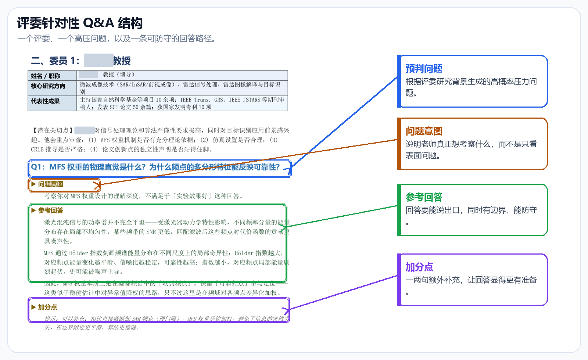
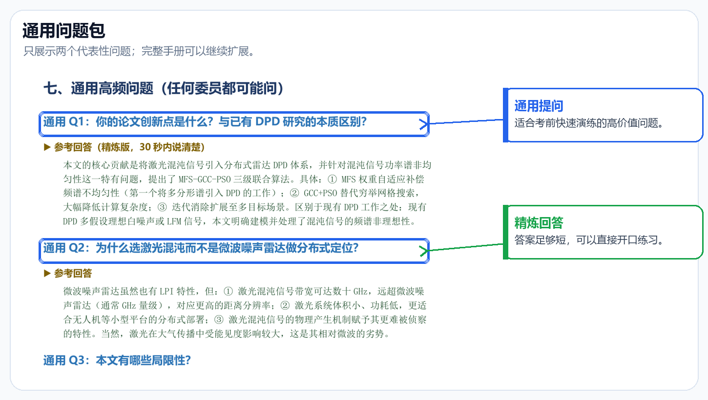
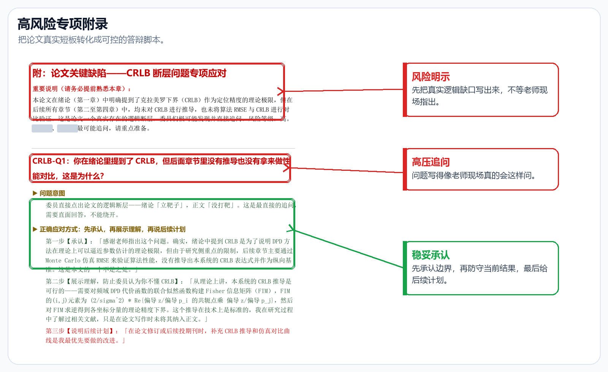

<div align="center">

# Thesis Defense Guide

### 毕业论文答辩 Q&A 备战 Skill

[](https://agentskills.io)
[](#兼容性)
[](LICENSE)
[](#word-输出)

**把你的论文、答辩材料和评委名单，转化成一份真正能用于答辩训练的 Q&A 手册。**

评委画像、风险雷达、阶段化提问、10/30/60 秒口头答案、追问脚本、Word 手册，一次整理清楚。

[English](README.md) | 中文

</div>

---

## 痛点

论文答辩准备最难的地方，不是把自己的论文再背一遍。

真正难的是：**谁会问什么、为什么会这么问、你的回答最多能说到什么程度**。

常见准备方式都有明显缺口：

| 方式 | 问题 |
|------|------|
| 套用通用答辩问题清单 | 太泛，和具体评委无关 |
| 反复读自己的论文 | 有助于记忆，但不能训练压力应对 |
| 直接问 AI“可能会问什么” | 很容易生成泛泛问题，没有评委背景 |
| 回避论文短板 | 一旦老师追问证据边界，很容易被打穿 |

## 解决方案

这个 Skill 会让 AI Agent 生成一份**按答辩委员逐个组织的答辩备战手册**。

它会读取你的论文或 PPT，调研评委公开资料，把每位老师的研究兴趣映射到你的论文内容上，然后生成能在现场说出口、边界清晰、不会过度承诺的答辩回答。

| 模块 | 功能 |
|------|------|
| **论文解析** | 提取题目、创新点、方法、实验、证据、局限和未来工作 |
| **评委调研** | 基于公开资料整理每位老师的研究方向、代表成果和证据等级 |
| **风险雷达** | 找出论文中最容易被追问的结论、假设和证据缺口 |
| **答辩阶段策略** | 区分开题、中期、预答辩、正式答辩、viva 和书面评审 |
| **Q&A 手册** | 生成按评委组织的问题、问题意图、参考回答、加分点和追问脚本 |
| **论断校准** | 把容易说过头的论文表述改成更稳妥的答辩说法 |
| **Word 输出** | 将 Markdown 手册转换成排版好的 `.docx` 文件 |

## 工作原理

Skill 按照一个从材料读取到最终演练手册的结构化流程执行：

```text
┌──────────────────┐     ┌──────────────────┐     ┌──────────────────┐
│   Phase 1        │     │   Phase 2        │     │   Phase 3        │
│                  │     │                  │     │                  │
│  论文读取        │────▶│  评委调研        │────▶│  答辩手册生成    │
│  与风险识别      │     │  与论文映射      │     │                  │
│                  │     │                  │     │                  │
│  • 读取论文      │     │  • 调研每位评委  │     │  • 编写 Q&A      │
│  • 提取核心论断  │     │  • 关联研究方向  │     │  • 加入追问脚本  │
│  • 找出证据短板  │     │    与论文内容    │     │  • 输出 DOCX     │
└──────────────────┘     └──────────────────┘     └──────────────────┘
```

### Phase 1：论文读取与风险识别

AI Agent 会读取论文、学位论文、答辩 PPT、开题报告或草稿材料，提取答辩最关键的内容：

- 研究问题和论文题目
- 主要创新点
- 方法路线和关键假设
- 实验、数据和评价指标
- 局限性和未来工作
- 论文论断与证据之间的缺口

**产出**：论文事实表、论文风险雷达、论断校准表。

### Phase 2：评委调研与论文映射

AI Agent 会优先使用公开资料调研每位评委，包括官方主页、实验室页面、论文、机构页面等。

它会区分：

- **已确认事实**：来自官网、CV、实验室主页等；
- **中等置信度模式**：来自近年论文主题的反复出现；
- **低置信度推断**：来自相邻研究方向的合理推测。

**产出**：评委画像、证据说明、评委-论文映射矩阵。

### Phase 3：答辩手册生成

AI Agent 会生成一份按评委组织、可以直接演练的答辩手册。

每位评委通常包括：

- 评委画像
- 潜在关切点
- 高概率问题
- 问题意图
- 10 秒回答
- 30 秒回答
- 60 秒回答
- 加分点
- 被追问时怎么接
- 连续追问脚本
- 最后的防守底线

## 答辩阶段差异

不同答辩阶段，老师关注点不一样。这个 Skill 会根据阶段调整问题重点：

| 阶段 | 委员主要关心 | 提问重点 |
|------|--------------|----------|
| **开题答辩** | 题目是否有价值、路线是否可行 | 研究空白、技术路线、预期验证、风险控制 |
| **中期答辩** | 项目是否按计划推进 | 已完成内容、未完成工作、进度风险、方法调整 |
| **预答辩** | 论文是否已经接近可提交 | 论文结构、证据缺口、创新点表述、修改优先级 |
| **正式答辩 / viva** | 贡献和证据是否站得住 | 创新性、严谨性、局限性、可复现性、推广边界 |
| **书面评审** | 文字论证链条是否清楚 | 证据来源、格式规范、论证结构、评审意见回应 |

如果用户没有说明阶段，Skill 会默认按正式答辩 / viva 处理，并在手册中说明这个假设。

## 防止过度承诺

这个 Skill 的目标是让你听起来**有底气，但不冒进**。

它不会帮你掩盖论文短板，也不会把证据薄弱的地方强行说圆，而是会帮你校准表达：

| 高风险说法 | 更稳妥的答辩方式 |
|------------|------------------|
| 把仿真结果说成真实系统验证 | 限定为仿真场景下的有效性 |
| 把相关性说成因果关系 | 说明观察到的关系，以及缺少的因果验证 |
| 把局部实验说成普遍有效 | 把结论限定在测试数据集或测试场景内 |
| 把未来工作说成已完成贡献 | 明确说这是下一步验证方向 |
| 回避缺少基线或消融实验 | 承认缺口，并说明现有证据仍能支持什么 |

这不是削弱你的工作，而是让你的回答更难被抓漏洞。

## 快速开始

### 安装

克隆或下载这个仓库：

```bash
git clone https://github.com/w1163222589-coder/thesis-defense-guide.git
```

如果在 Codex 中使用，把 skill 文件夹复制到 Codex skills 目录：

```bash
cp -r thesis-defense-guide ~/.codex/skills/
```

Windows 通常是：

```text
C:\Users\<USER>\.codex\skills\thesis-defense-guide
```

安装后重启 Codex。Claude Code 等兼容 Agent 也可以直接把这个仓库作为项目上下文或自定义指令目录引用。

也可以通过 CC Switch 安装：Skills 面板 → Add from GitHub → 粘贴仓库 URL。

### 必需输入

正式开始调研和写作前，需要提供：

1. 你的论文或答辩材料；
2. 答辩委员会 / 评委名单；
3. 学校、学院、专业、项目或实验室背景。

支持 PDF、DOCX、PPTX、Markdown、纯文本，或一个包含论文和 PPT 的文件夹。

### 使用示例

在 Codex 或其他兼容 Agent 中可以这样说：

```text
使用 $thesis-defense-guide 帮我生成一份答辩准备手册。
我的论文和答辩材料在这个文件夹，评委名单如下，
这是电子科技大学某专业的硕士正式答辩。
请输出 Word 手册，包括评委画像、风险雷达、论断校准表、
评委逐个问题、追问脚本和 10/30/60 秒口头答案。
```

开题答辩可以这样说：

```text
使用 $thesis-defense-guide 准备我的开题答辩。
重点关注研究价值、可行性、技术路线、预期验证和评委可能质疑的问题。
```

预答辩可以这样说：

```text
使用 $thesis-defense-guide 准备我的预答辩。
重点关注论文结构、实验缺口、创新点表述和正式提交前的修改优先级。
```

## 输出结构

```text
defense-guide/
├── defense-guide.md          # Markdown 源手册
├── defense-guide.docx        # 排版后的 Word 手册
└── sources-appendix.md       # 可选：公开资料来源附录
```

手册内容通常包括：

```text
Thesis Defense Q&A Guide
├── 背景与使用说明
├── 答辩阶段策略
├── 论文事实表
├── 论文风险雷达
├── 论断校准表
├── 评委-论文映射矩阵
├── 委员 1
│   ├── 画像
│   ├── 潜在关切点
│   ├── 高概率 Q&A
│   ├── 连续追问脚本
│   └── 防守底线
├── 委员 2
├── 通用答辩控制
├── 考前一页纸
└── 来源附录
```

## 示例效果

下面的示例图基于一份已匿名化处理的真实答辩准备手册制作。这里不再整页铺大图，而是裁切关键区域，并用标注说明每个模块的作用。

### 评委针对性 Q&A 结构

<p align="center">
  
</p>

### 通用问题包

<p align="center">
  
</p>

### 高风险专项附录

<p align="center">
  
</p>

## Word 输出

内置转换器可以把生成的 Markdown 手册转换成排版好的 `.docx`：

```bash
python scripts/markdown_to_docx.py \
  --input defense-guide.md \
  --output defense-guide.docx \
  --title "Thesis Defense Q&A Guide"
```

转换器支持：

- 标题和评委章节
- Markdown 表格
- 问题标签
- 灰底答案框
- 对话式追问脚本
- 页眉页脚

## 关键设计选择

### 为什么按评委组织？

真实答辩问题受提问者背景影响很大。做优化的老师会看算法假设，做系统的老师会问工程实现，做信号处理的老师会盯理论严谨性。按评委组织，复习时更接近真实压力。

### 为什么要有风险雷达？

学生通常喜欢准备最强的部分，但评委往往会问最薄弱的地方。风险雷达把证据短板提前暴露出来，让你在正式答辩前就准备好边界清楚的回答。

### 为什么要有 10/30/60 秒回答？

答辩现场节奏不固定。有时你只需要一句话，有时老师会让你展开解释。分层答案可以避免你临场啰嗦，也避免回答太短显得没准备。

### 为什么强调不要过度承诺？

答辩中最容易被抓住的不是“承认局限”，而是“把证据说过头”。一个能清楚承认边界的回答，通常比一个过度自信但证据不足的回答更有说服力。

## 常见失败模式及 Skill 的应对

| 失败模式 | 表现 | Skill 如何避免 |
|----------|------|----------------|
| **问题太泛** | 任何论文都能套用 | 评委-论文映射矩阵强制关联具体老师背景 |
| **论断过强** | 回答听起来很强，但证据支撑不住 | 论断校准表重写高风险表述 |
| **回避局限** | 一被追问短板就卡住 | 风险雷达把局限转化为可准备的回答 |
| **阶段混乱** | 开题问题和正式答辩问题混在一起 | 答辩阶段策略调整提问重点 |
| **编造评委资料** | 公开资料变成 AI 幻觉 | 证据等级区分确认事实和推断 |

## 兼容性

| 平台 | 状态 | 说明 |
|------|------|------|
| OpenAI Codex | 完全支持 | 主要开发和测试平台，使用本地文件工具、公开资料调研和内置 DOCX 转换器 |
| Claude Code | 兼容 | 这个流程是 Agent 可读的，可用等价的文件、调研和 Python 工具适配 |
| 其他 AI Agent | 可适配 | 只要能读取文件、浏览公开资料并运行 Python，就可以适配这个流程 |

## 项目结构

```text
.
├── README.md
├── README_ZH.md
├── LICENSE
├── SKILL.md
├── agents/
│   └── openai.yaml
├── references/
│   ├── manual-structure.md
│   └── style-rubric.md
├── assets/
│   └── screenshots/
└── scripts/
    └── markdown_to_docx.py
```

## 贡献

欢迎提交 Issue、建议和 PR。

适合贡献的方向包括：

- 更强的答辩手册示例
- 更细的评委调研清单
- Word 排版优化
- 双语答辩回答模板
- 不同学科的阶段化提问模式

## License

MIT

## 致谢

- [OpenAI Codex](https://openai.com/codex/) — 用于构建和测试本 Skill 的 AI 编码代理平台
- [Agent Skills](https://agentskills.io) — 可复用 Agent 能力的开放标准
- 真实论文答辩压力 — 这个 Skill 存在的原因
