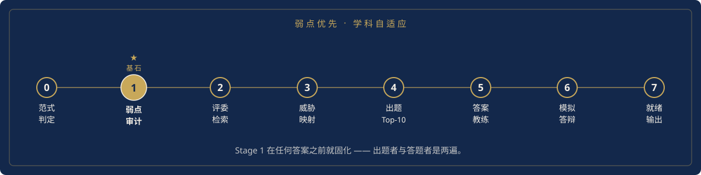
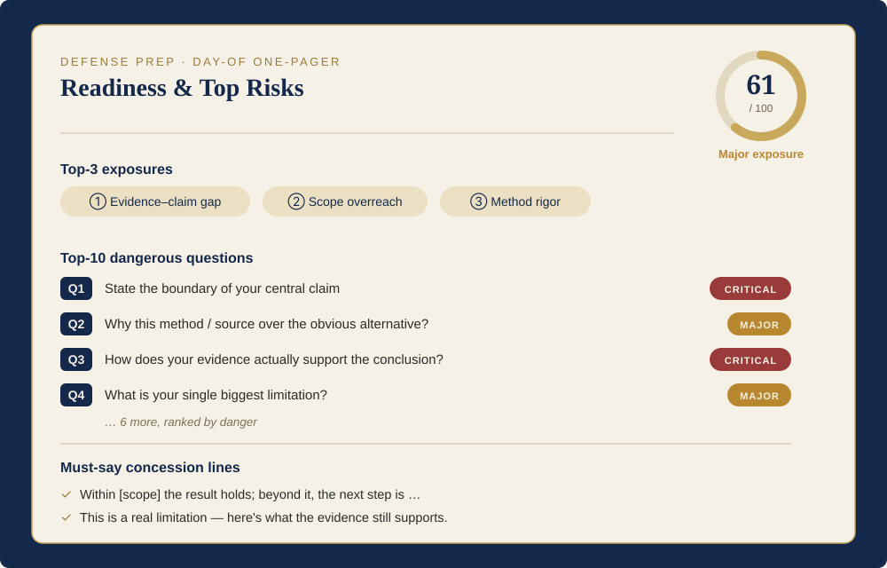

<div align="center">


# Thesis Defense Guide

### 面向全门类的毕业答辩模拟与风险预判系统

[](https://agentskills.io)
[](CHANGELOG.md)
[](#兼容性)
[](LICENSE)
[](#输出)

**把你的论文、答辩 PPT 和评委名单,转成一份按评委逐人组织的答辩手册——含一次诚实的弱点审计、反推出来的问题、有边界的答案、可交互的模拟答辩,以及一个就绪度评分。**

支持**任意门类**——理、工、社科、人文、法学、艺术——靠"研究范式判定"自动切换评判标准。

[English](README.md) | 中文

</div>

---

## 目录

🧩 [痛点](#痛点) · 🎯 [解决方案](#解决方案) · 🧭 [工作流](#工作流) · 🎓 [学科覆盖](#学科覆盖) · 📄 [输出](#输出) · 📥 [必需输入](#必需输入) · 🚀 [快速开始](#快速开始) · 🗂️ [项目结构](#项目结构) · 🔌 [兼容性](#兼容性) · 🙏 [致谢](#致谢)

---

## 痛点

答辩准备最难的,不是把论文再背一遍,而是**谁会问什么、为什么这么问、你的回答最多能说到哪**——以及**在评委之前先找出自己的软肋**。

| 常见做法 | 缺口 |
|---|---|
| 套通用问题清单 | 太泛,和你的评委、你论文真正的弱点都无关 |
| 反复读论文 | 帮记忆,不练抗压 |
| 直接问 AI"可能问什么" | 问题泛泛、没有评委背景;而且同一个声音既出题又写安心答案,会把真正要命的攻击悄悄软化 |
| 回避短板 | 老师一追证据边界就被打穿 |

## 解决方案

本 skill 让你的材料走一条**对抗式流水线**,产出可直接演练的成果:

1. **判定研究范式**,用**该领域**的标准评判一切。
2. **先于评委、独立地审弱点**:一个只负责攻击的环节产出**只读的弱点账本**(按严重度排序、标注位置)。
3. **由弱点反推问题**,排成**十大最危险问题**。
4. **教练有边界的答案**:绝不过度承诺(4 步骨架、10/30/60 秒分层、对致命点一律认账+重定向)。
5. **检索评委**(证据分级)用于重新加权与个性化——**绝不编造**。
6. **模拟答辩**:一个**保持攻击强度**、答得一般绝不放过你的交互式评委。
7. **就绪度评分(0–100)**,并**按风险**优先交付,以"答辩当天一页纸"打头。

### 与众不同之处

- **生成器/评估器分离。** 攻击和答案是**两遍**。弱点审计在任何答案出现前先固化、之后只读——所以真正能让你翻车的问题不会被悄悄抹平。
- **弱点优先的主干。** 问题先来自论文弱点,评委检索只用来加权。哪怕完全查不到某位评委,危险问题照样浮现。
- **学科自适应。** 范式层换镜片:经济论文用计量识别、历史论文用史料批判、数学论文用证明有效性——同一引擎、不同镜片。
- **反过度承诺写成 `IRON RULES`。** 仿真不当实测、相关不当因果、未来工作不当已完成贡献——手册认账真实局限,而不是吹大。

---

## 工作流

<div align="center">

</div>

每个阶段都有专门的 reference 文件撑"怎么做",`SKILL.md` 保持精简,只管"做什么" + IRON RULES。论文改版后只重跑弱点审计 + 模拟答辩。

## 学科覆盖

判定的是**范式**,不是专业——少数几个范式家族覆盖所有领域。

<details>
<summary><b>六大范式家族</b> — 点击展开</summary>

| 家族 | 示例学科 | 评判标准 |
|---|---|---|
| 实证–定量 | 理工、定量社科、金融 | 设计、识别、基线、可复现 |
| 实证–定性 | 人类学、社会学、教育 | 立场性、饱和、三角验证、可迁移 |
| 理论–形式 | 数学、理论 CS、分析哲学 | 证明有效性、假设、非平凡 |
| 文本–阐释 | 文学、历史、区域研究 | 史料批判、语境化、史学对话 |
| 法学–规范 | 法学、法理、规范伦理 | 教义准确、判例、对立论证 |
| 设计–创作 | 艺术、设计、建筑、创意写作 | 技艺、概念–作品链接、对实践的贡献 |

</details>

混合/交叉学科会加载两套镜片,并盯住"接缝"。

## 输出

<div align="center">

</div>

**按风险、而非按完整度**交付(默认首交付物=一页纸):

- **Tier A 答辩当天一页纸**:一句话定位、就绪度评分 + 三处最危险暴露、十大问题配 30 秒答案、必背认账话术。
- **Tier B 评委战卡**:证据分级画像 + 招牌问题 + 这一位要避的坑。
- **Tier C 弱点雷达与校准**:严重度排序账本 + 声明校准表。
- **Tier D 模拟答辩记录**:演练逐字稿、卡壳点、重排优先级。
- **Tier E 完整 Word 手册**:逐评委全量指南(`.docx`)。

**0–100 就绪度评分** + 暴露等级,告诉你有限时间该花在哪。

---

## 必需输入

1. 论文或答辩材料(PDF / DOCX / PPTX / Markdown / 文本 / 文件夹)。
2. 答辩委员会名单(必须有姓名)。
3. 院校/专业背景(以及已知的答辩阶段)。

## 快速开始

对你的 Agent 说:

```text
用 thesis-defense-guide 给我做一份答辩备战手册。
论文已附上,委员有:[姓名+职称],
这是在[学校/专业]的硕士最终答辩。
先给我答辩当天一页纸和十大危险问题。
```

### 安装

**Codex:** 把文件夹拷进 skills 目录:

```bash
git clone https://github.com/w1163222589-coder/thesis-defense-guide.git
cp -r thesis-defense-guide ~/.codex/skills/
```

**Claude Code / Cowork:** 放到你的 skills 目录(如 `~/.claude/skills/`)或作为插件安装,然后重启。任何能读文件、检索公开资料、运行 Python 的 Agent 都能用。

> 自带的 `scripts/markdown_to_docx.py` 生成排版好的 `.docx`;只要 Markdown 输出则无需它。

---

## 项目结构

<details>
<summary><b>仓库结构</b> — 10 个 reference + 精简编排</summary>

```text
.
├── SKILL.md                     # 精简编排:输入、IRON RULES、Stage 0–7、输出分层
├── references/
│   ├── discipline-profiles.md         # 学科自适应镜片(6 家族)  ← 先读
│   ├── weakness-audit-framework.md    # 三镜片 + DA 维度 + 严重度 → 弱点账本
│   ├── ppt-audit-checklist.md         # PPT 专项审计(可选,有幻灯时)
│   ├── evaluator-research-protocol.md # 证据分级检索 + 名单核验
│   ├── question-generation-rules.md   # 弱点→问题引擎、升级阶梯、Top-10
│   ├── answer-coaching-framework.md   # 4 步有边界答案、按严重度定姿态、反过度承诺
│   ├── mock-defense-protocol.md       # 交互式、保持攻击强度的模拟评委
│   ├── readiness-rubric.md            # 0–100 就绪度评分 + 等级
│   ├── manual-structure.md            # Tier-E 手册骨架 + 高亮标签
│   └── style-rubric.md                # 语气 + Word 排版
├── scripts/
│   └── markdown_to_docx.py
├── agents/openai.yaml
├── CHANGELOG.md
├── README.md / README_ZH.md
└── LICENSE
```

</details>

## 兼容性

| 平台 | 状态 |
|---|---|
| OpenAI Codex | 支持(本地文件工具、网络检索、自带 DOCX 转换) |
| Claude Code / Cowork | 支持(等价的文件、检索、Python 能力) |
| 其它 Agent | 可适配——需要读文件、检索公开资料、运行 Python |

<div align="center">

</div>

## 致谢

对抗式审稿的设计借鉴了 [**Academic Research Skills**](https://github.com/Imbad0202/academic-research-skills)(作者 Cheng-I Wu)的若干理念:Devil's Advocate 审稿模式、"三镜片"审稿思维框架、攻击强度保持(attack-intensity-preservation),以及"认知框架 / IRON RULE"的写法。这些理念经重新实现并改造用于答辩准备,**未复制其文本**。

另:感谢 [Agent Skills](https://agentskills.io),以及真实的答辩压力——本 skill 存在的理由。

## 许可

MIT
